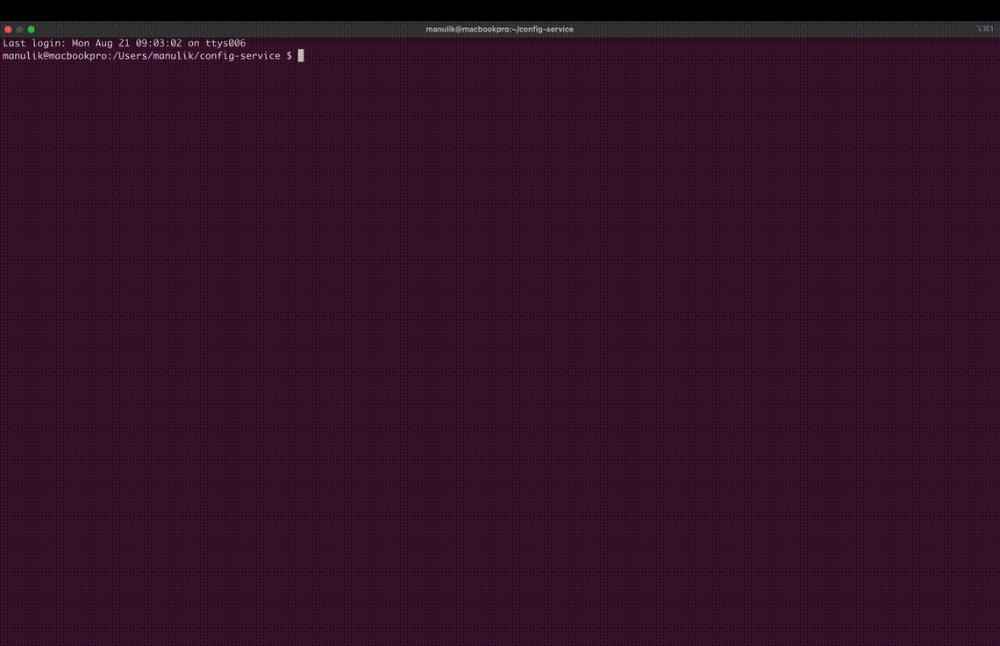

## Config Service

### Demo




### Prerequisites
```sh
brew cask install docker
brew install minikube helm
```

### Quick start
```sh
# Deploy minikube, build docker image and deploy application using Helm
./launcher.sh bootstrap

# Terminate and clean up everything
./launcher.sh shutdown
```
  
### Project structure:
    .
    ├── docs/                        ## Documentation in .md format
    ├── flaskr/                      ## Config Service application directory
        ├── configs/                 # Set of configuration files (test cases)
        ├── configuration.json       # Configuration file with settings for Config Service
        ├── requirements.txt         # Dependencies for config-service 
        ├── schema.json              # JSON schema which is used to validate config files
        └── service.py               # Config Service application code  
    ├── helm/                        ## Helm chart of the Config Service with dependencies
    ├── config-service.Dockerfile    # Image build instructions
    ├── curl_tests.sh                # Sample test cases
    ├── docker_helper.sh             # Wrapper for docker operations
    ├── helm_helper.sh               # Wrapper for helm operations
    ├── launcher.sh                  # Main controller
    ├── minikube_helper.sh           # Wrapper for minikube operations
    └── README.md
